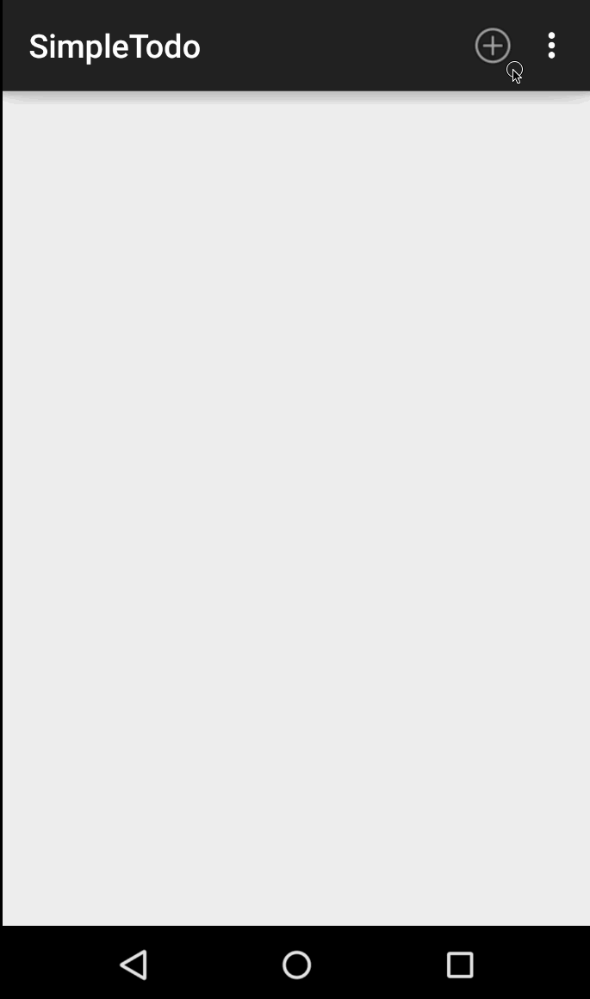

# Simple ToDo App
This is the Codepath initial ToDo App for the Android Bootcamp class.  This project helps the student obtain a familiarity with the Android Studio IDE and Emulator.  It demonstrates many of the simple features of an android application such as Activities, Primitive form elements, Adapters, Click Handlers, and Intents.

Initial Requirements took about 2 hours to complete.

You can use this application to:
* Create Todo List Items
* Edit existing Todo items
* Remove completed Todo items

Walkthrough of the Todo Application:

*Gif created with [LiceCap](http://www.cockos.com/licecap/).*

Planned improvements include:
* Add Deadline with Alerts
* Swipe to the left to mark as completed
* Swipe to the right to snooze