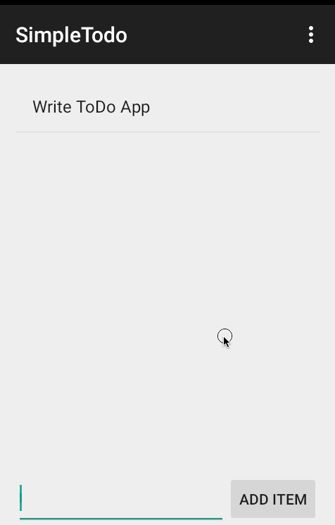

# Simple ToDo App
This is the Codepath initial ToDo App for the Android Bootcamp class.  This project helps the student obtain a familiarity with the Android Studio IDE and Emulator.  It demonstrates many of the simple features of an android application such as Activities, Primitive form elements, Adapters, Click Handlers, and Intents.

Initial Requirements took about 2 hours to complete.

You can use this application to:
* Create Todo List Items
* Edit existing Todo items
* Remove completed Todo items

### Walkthrough of the Todo Application

### Features
Requirements Complete:
* [x] Can add and remove items.
* [x] Can edit items via a new activity
* [x] Items persist via file read and write
* [x] Code pushed to Github
* [x] Readme with GIF walkthrough
* [x] Issue created

Optional Suggestions Added:
* [x] Added Priority
* [x] Changed backend to use SQLite via ActiveAndroid
* [x] Added a FragmentDialog for adding new items.
* [x] Display items using a custom adapter (Item with Priority)

Planned improvements include:
* Add Deadline with Alerts
* Swipe to the left to mark as completed
* Swipe to the right to snooze

### Old Walkthroughs:

#### Version 1

*Gif created with [LiceCap](http://www.cockos.com/licecap/).*